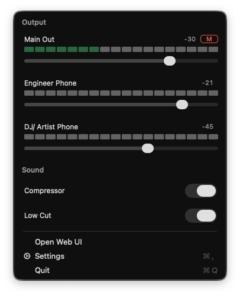

# M828 Mac Menu Bar

Native macOS/AppKit menu bar controller for a MOTU 828ES or another AVB mixer with HTTP-accessible control endpoints.



## What It Does

- Adds a menu bar item named `828`.
- Shows the sections and controls you add in the Menu Layout editor.
- Provides a settings window for:
  - mixer IP/host,
  - scanning available mixer inputs and outputs from the configured IP,
  - scanning available control sources from the MOTU datastore,
  - building the menu manually from sections and source-backed elements,
  - auto-start through macOS login items.

## Install

The app is a **universal build** (Apple Silicon + Intel) and is **unsigned** — it is ad-hoc signed but not notarized, because there is no Apple Developer account. It requires **macOS 13 (Ventura) or newer**.

### Download

Download the latest `Menubar-Native-Control-<version>-macos-universal.zip` from the [Releases page](https://github.com/kellertobias/m828-mac-menubar/releases/latest), unzip it, and move **Menubar Native Control.app** to `/Applications`. Because the download is quarantined and not notarized, macOS Gatekeeper blocks the first launch until you clear the quarantine flag:

```sh
xattr -dr com.apple.quarantine "/Applications/Menubar Native Control.app"
```

### Homebrew

The cask downloads the same prebuilt release, then clears quarantine and re-signs the app locally, so it launches with no Gatekeeper prompt and no manual step:

```sh
brew tap kellertobias/m828-mac-menubar https://github.com/kellertobias/m828-mac-menubar.git
brew trust --cask kellertobias/m828-mac-menubar/menubar-native-control
brew install --cask kellertobias/m828-mac-menubar/menubar-native-control
```

`brew trust` is only required if you run Homebrew with `HOMEBREW_REQUIRE_TAP_TRUST` set; it is harmless otherwise. The cask tracks the newest release (`version :latest`), so `brew upgrade` does **not** detect new versions — update with:

```sh
brew update
brew reinstall --cask kellertobias/m828-mac-menubar/menubar-native-control
```

## Build And Run

This project is a Swift Package, so it can build without an Xcode project:

```sh
swift run MenubarNativeControl
```

If SwiftPM tries to write caches outside the workspace, use:

```sh
CLANG_MODULE_CACHE_PATH="$PWD/.build/clang-module-cache" swift run MenubarNativeControl
```

## Package As An App

Create a menu-bar-only `.app` bundle:

```sh
./build archive
```

The app is written to:

```text
.build/Menubar Native Control.app
```

Install the archived app into `/Applications`:

```sh
./build archive install
```

Set `INSTALL_DIR` to install somewhere else:

```sh
INSTALL_DIR="$HOME/Applications" ./build archive install
```

Auto-start works best from the packaged app, because macOS login item registration expects an application bundle.

## Releases

Releases are fully automated from [Conventional Commits](https://www.conventionalcommits.org/). Two providers cooperate:

- **Forgejo** (`git.tokenet.de`, canonical) owns versioning only — it never builds the app, so it needs no macOS runners. On every push to `main`, [`.forgejo/workflows/release.yml`](.forgejo/workflows/release.yml) — if there are release-worthy commits — bumps [`VERSION`](VERSION), commits `chore(release): vX.Y.Z`, and creates and pushes the annotated `vX.Y.Z` tag. The release commit deliberately carries no `[skip ci]` marker (that marker would also skip the mirrored GitHub tag build); the job simply re-runs as a harmless no-op on its own release commit because there are no commits since the new tag.
- **GitHub** (push mirror) reacts to that tag. [`.github/workflows/release.yml`](.github/workflows/release.yml) builds the app as a **universal binary** (Apple Silicon + Intel) on `macos-15` (Xcode 16 / Swift 6) and, only if the build succeeds, publishes a GitHub Release. It uploads a per-version `.zip` and a stable, version-less `.tar.gz` (consumed by the [Homebrew cask](Casks/menubar-native-control.rb)), each with its own SHA-256 checksum. A macOS runner is required because the app links AppKit; GitHub-hosted runners cover this with no self-managed infrastructure. The publish step is idempotent, so a re-run updates the release instead of failing.

### Version mapping

| Commit type | Release |
| --- | --- |
| `fix:`, `perf:`, `revert:` | patch (`x.y.Z`) |
| `feat:` | minor (`x.Y.0`) |
| `<type>!:` or a `BREAKING CHANGE:` footer | major (`X.0.0`) |
| `docs:`, `test:`, `style:`, `refactor:`, `build:`, `ci:`, `chore:` | no release |

`VERSION` is the single authoritative source; `Scripts/package-app.sh` reads it into the app bundle's `CFBundleShortVersionString`/`CFBundleVersion`. The first automated release is `1.0.0`.

Preview the next version without releasing anything:

```sh
node Scripts/next-version.mjs   # prints the next version, or nothing if no release is due
```

### Setup requirements

- Forgejo secret **`SEMANTIC_RELEASE_TOKEN`** with `write:repository` scope (pushes the release commit and tag; the default job token is not sufficient for protected `main`).
- GitHub uses the built-in `GITHUB_TOKEN` (the release job has `contents: write`) — no extra secret needed.

The published artifacts are a per-version `Menubar-Native-Control-<version>-macos-universal.zip` plus a stable `Menubar-Native-Control-macos-universal.tar.gz` that always points at the newest release (consumed by the Homebrew cask). See [Install](#install) for how to get and run them.

## Endpoint Configuration

Endpoint fields accept either relative paths against the mixer host or full URLs.

For write operations:

- If the endpoint contains `{value}`, the app substitutes the value and sends a `GET`.
- MOTU `/datastore/...` writes are sent like the web app sends them: `POST /datastore?client=...` with a `json` form payload.
- Other endpoints are sent with `PUT` and a `text/plain` body.

Examples:

```text
/datastore/ext/some/path?value={value}
http://192.168.1.100/datastore/ext/some/path?value={value}
```

For reads, the app sends `GET` and accepts plain text or JSON with common fields such as `value`, `val`, `data`, `current`, or `name`.

MOTU datastore paths vary by firmware and mixer configuration, so the defaults intentionally leave endpoint paths empty. Fill them from the MOTU web app/API paths you want to control.

## Scanning Mixer I/O

After entering the mixer IP in Settings, click `Scan Mixer I/O`.

The app queries common MOTU datastore roots and opens a results window grouped into inputs, outputs, and other named endpoints. Each entry shows the discovered base path plus likely name, volume, level, and mute paths when those keys are present in the returned datastore.

Use `Scan Control Sources` to read `/datastore` and populate the source/control pickers in the Menu Layout editor. Scanning only updates the available picker catalog; it does not add anything to the menu.

Fader rows in the Menu Layout editor include `Min` and `Max` fields. Scanned controls are prefilled with their discovered range, and manual faders default to `0` and `1`.

In Menu Layout, add your own sections and elements. For each element, choose a scanned source first, then choose what that element controls for that source. The menu supports:

- input trims, pad, and +48V where the mixer exposes them,
- phones and monitor output trims,
- monitor level and mute,
- mixer channel faders, main sends, aux sends, group sends, mutes, compressor toggles, and four EQ-band toggles,
- mixer group faders, mutes, and main sends.

Each element keeps an editable endpoint field for advanced manual overrides. The menu is built from this layout; there are no separate fixed channel or special sections.

Datastore writes use the same protocol as the MOTU web app: `POST /datastore?client=...` with a `json` payload. Direct `PUT /datastore/...` is rejected by the tested firmware.

On current MOTU AVB firmware, live meters are exposed through HTTP polling rather than websocket. The web app polls:

```text
/meters?meters=mix/gate:mix/comp:mix/level:mix/leveler:ext/input
```

The app supports scalar meter endpoint paths in channel `Level` fields:

```text
meters/ext/input/14
meters/mix/level/5/14
```

Meter values are normalized from MOTU's `0...1000` response scale to the app's `0...1` level indicator scale.

## License

M828 Mac Menu Bar is released under the MIT License. See [LICENSE](LICENSE).
